# Vibearchy

**A complete Arch Linux + Hyprland desktop experience. Privacy-respecting, GPU-accelerated animations, seamlessly integrated AI tools. Managed with GNU Stow for surgical dotfile deployment.**

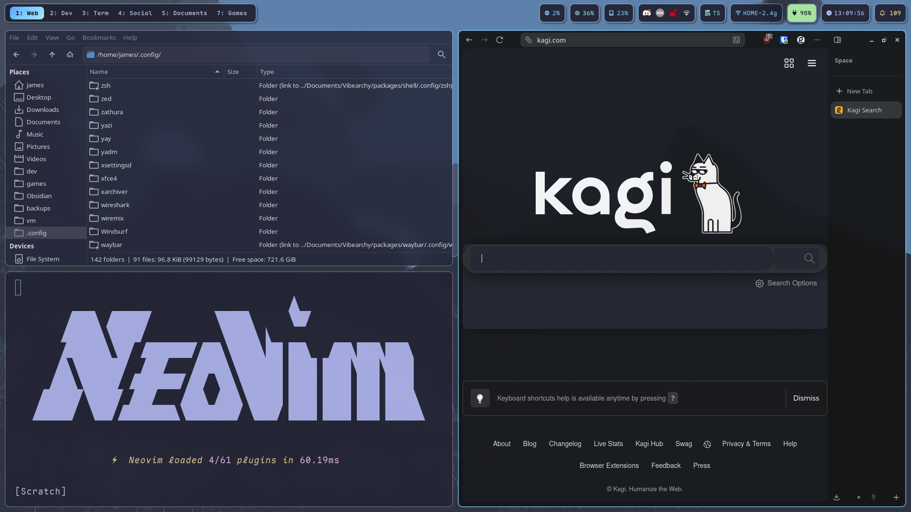

---

## Why Linux in 2025?

Windows has become a liability. Forced telemetry, embedded advertising in your Start menu, Copilot harvesting your keystrokes, and an operating system that increasingly treats you as the product rather than the customer. Every update brings new "features" you didn't ask for and can't fully disable.

Meanwhile, the open-source community has been quietly building something better.

**Hyprland** delivers the fluid, GPU-accelerated window management that macOS users brag about—but with actual customization. Smooth 144Hz animations, dynamic tiling, and workspaces that adapt to how *you* work. No artificial limitations. No "Pro" tier to unlock basic features.

**Modern Linux** in 2025 isn't the terminal-only experience your IT friend warned you about in 2010. Steam's Proton runs most Windows games natively. Flatpak delivers sandboxed applications with one click. Hardware support rivals Windows for most laptops. And when something *does* need configuring, you actually *can* configure it—no registry hacks or third-party debloaters required.

That old laptop collecting dust? It'll run circles around Windows 11's bloated resource consumption. That gaming PC? It'll run cooler and faster without Windows Defender eating 15% of your CPU in the background.

---

## What is Vibearchy?

Vibearchy is a complete, opinionated system configuration—not just scattered config files. It's the answer to "I want to try Linux but don't know where to start" and "I've used Linux for years but my desktop still looks like 2008."

**The stack:** Fish shell with Starship prompt. Ghostty GPU-accelerated terminal. Waybar status bar with custom modules. swww for smooth animated wallpapers. Catppuccin-based theming across every application. Zen Browser and Mullvad VPN for privacy. Claude Code, AIChat, and Ollama for AI assistance.

**The philosophy:** Everything wired together, ready to deploy, batteries included.

### AI That Actually Helps

The AI integrations in Vibearchy aren't gimmicks bolted onto the side. They're lightweight, privacy-conscious tools that solve real problems:

- **Clipboard AI** — Highlight text anywhere, hit a keybind, get an instant explanation, translation, or summary. No browser tab required.
- **AI Menu** — Quick access to local Ollama models or Claude for longer conversations. Your choice of model, your data stays local when you want it to.
- **Command helpers** — Fuzzy search your shell history with AI-suggested completions. Stop Googling the same `tar` flags.

No Microsoft account. No cloud dependency for basic features. No "Copilot wants to help you write this email" interruptions.

---

## At a Glance

*Fish shell + Starship prompt. Ghostty terminal. Waybar status. swww animated wallpapers. Catppuccin themes. Claude Code, AIChat, Ollama. Zen Browser + Mullvad. All wired together.*

---

## Screenshots

### Desktop & Apps

| Zed IDE | Zen Browser |
|---------|-------------|
| 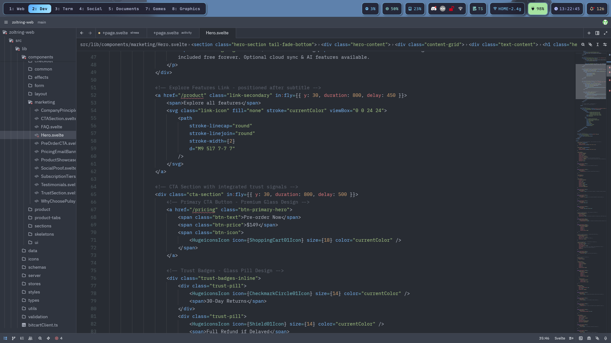 | 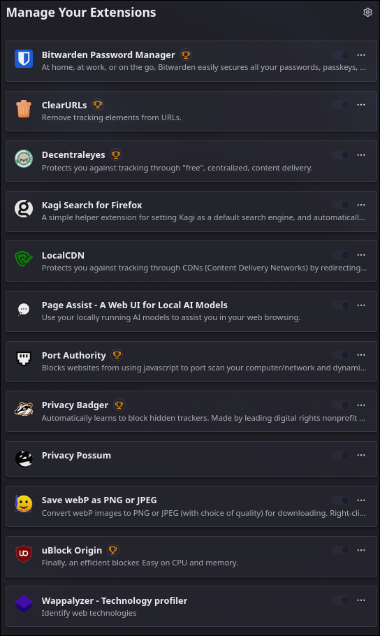 |

### System
| Fastfetch | btop |
|-----------|------|
| 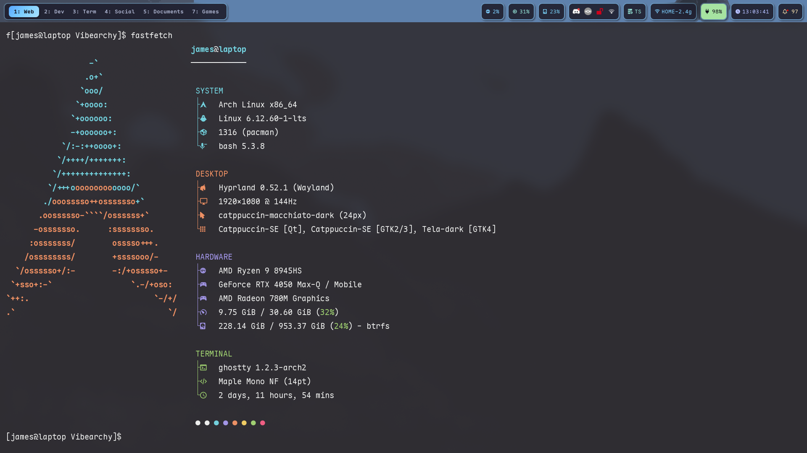 | 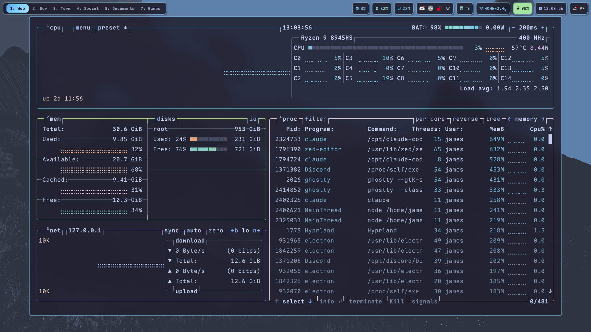 |

### Notifications
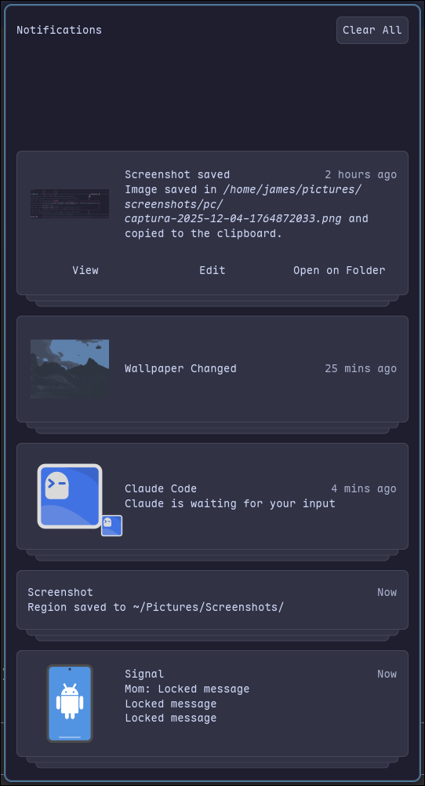

### Rofi Menus
| App Launcher | Keybinds | Wallpaper |
|--------------|----------|-----------|
| 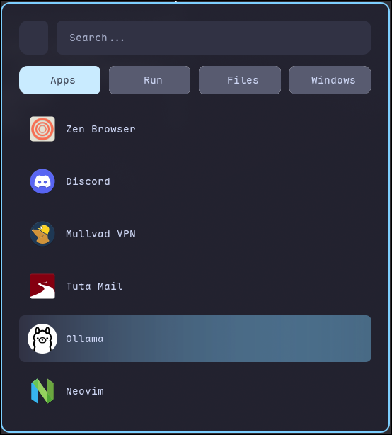 | 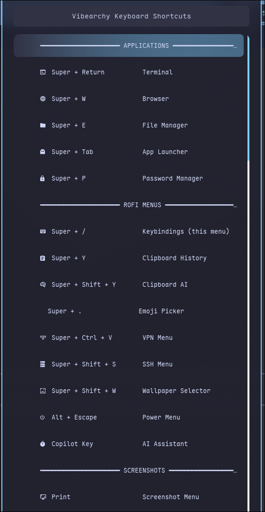 | 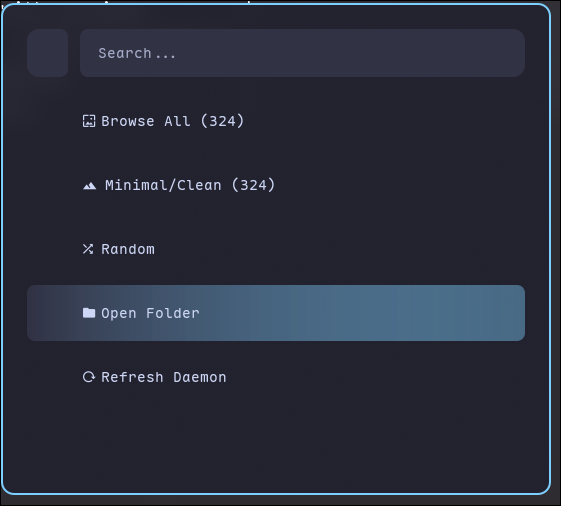 |

| Clipboard | Emoji | Screenshot |
|-----------|-------|------------|
| 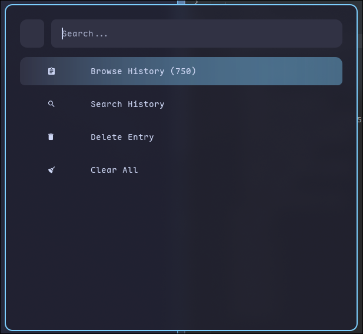 | 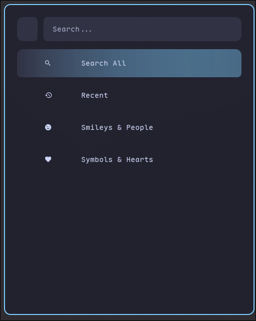 | 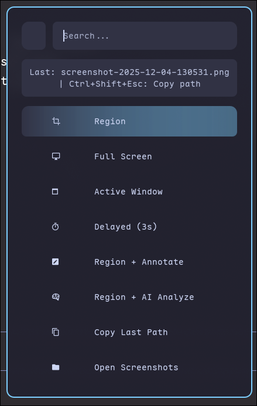 |

| AI Menu | VPN | SSH |
|---------|-----|-----|
| 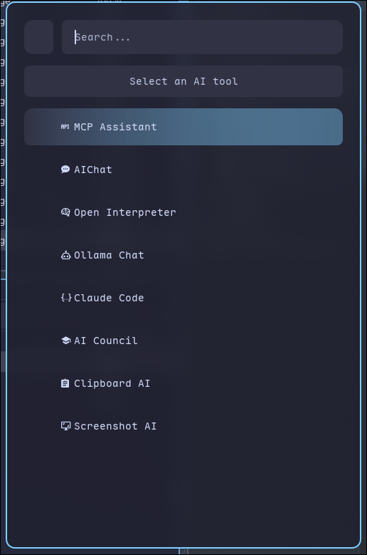 | 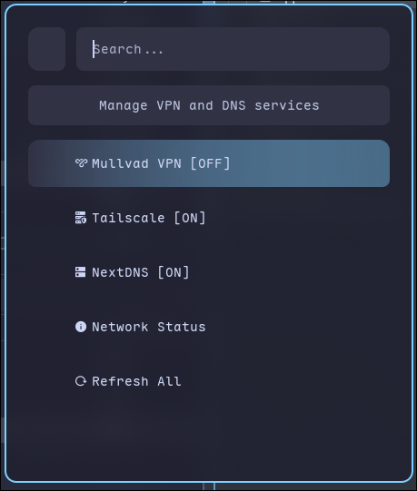 | 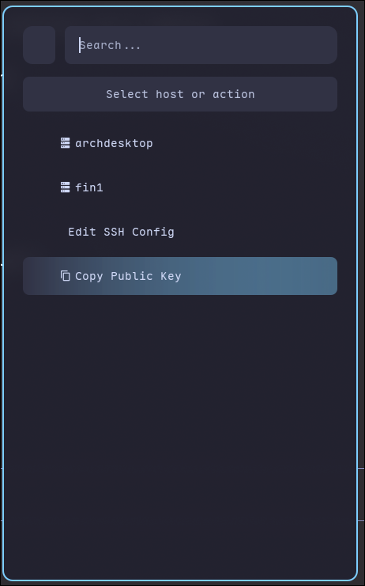 |

---

## Philosophy

Vibearchy is not just a dotfiles repo. It's a **complete system philosophy**.

I believe in:
- **Privacy by default**, not as an afterthought
- **Open source when possible**, always transparent
- **Tools that respect your time** and attention
- **No subscriptions** for basic productivity
- **Software that sparks joy**, not frustration

While others argue about tiling window managers, Vibearchy users are too busy being productive in their beautifully animated, blur-enabled, AI-enhanced workflows.

---

## The Opinionated Stack

### Privacy & Security

| App | Why I Chose It |
|-----|-----------------|
| **Zen Browser** | Firefox fork with vertical tabs and privacy baked in. Chrome is a surveillance tool. |
| **Mullvad VPN** | No-logs VPN that accepts cash. No email required. No accounts. Just privacy. |
| **Tailscale** | Zero-config mesh VPN. Connect your devices securely, anywhere. |
| **NextDNS** | Encrypted DNS with ad/tracker blocking. Your ISP doesn't need to know what you browse. |
| **Bitwarden** | Open-source password manager. Your passwords shouldn't live in Chrome. |
| **Veracrypt** | Full disk encryption for the truly paranoid. |
| **Signal** | End-to-end encrypted messaging. WhatsApp is owned by Facebook. |

### Productivity

| App | Why I Chose It |
|-----|-----------------|
| **Obsidian** | Second brain for networked thought. Local-first, Markdown, yours forever. |
| **NextCloud** | Self-hosted cloud storage. Your files, your server, your rules. |
| **LibreOffice** | Full office suite. No subscriptions, no cloud lock-in. |
| **Tuta Mail** | Encrypted email that respects you. Gmail reads your emails. |

### Development

| App | Why I Chose It |
|-----|-----------------|
| **Claude Code** | AI pair programming in your terminal. Context-aware, agentic, powerful. |
| **Zed** | Lightning-fast editor from the Atom creators. Written in Rust. |
| **Ghostty** | GPU-accelerated terminal. Beautiful and blazingly fast. |
| **Neovim** | The editor for the enlightened. Configured with LazyVim. |

### AI & Local Models

| App | Why I Chose It |
|-----|-----------------|
| **Claude Code** | AI pair programming in your terminal. Context-aware, agentic, powerful. |
| **AIChat** | All-in-one AI CLI. Gemini, GPT, Claude, Ollama - with MCP tools and memory. |
| **Open Interpreter** | Natural language computer control. Run code, manage files, browse web. |
| **Me and My Friends** | AI advisory council. 7 AI personas for diverse perspectives on decisions. Also I made it :P. |
| **Ollama** | CLI for local models. Simple, fast, scriptable. |
| **LM Studio** | Run LLMs locally with a GUI. Private, offline, no API costs. |

### Creativity

| App | Why I Chose It |
|-----|-----------------|
| **GIMP** | Photoshop, but free and freedom-respecting. |
| **OBS Studio** | Stream and record like a pro. |
| **DaVinci Resolve** | Hollywood-grade editing, color grading, VFX. Free forever, no subscriptions. |

### Utilities

| App | Why I Chose It |
|-----|-----------------|
| **Thunar** | File manager with custom actions for AI analysis, terminals, and more. |
| **KDE Connect** | Your phone and PC, unified. Notifications, file transfer, remote control. |
| **btop** | Beautiful system monitor. htop is so last decade. |
| **Fastfetch** | Flex your system specs in style. |
| **RAM Guardian** | Memory monitor with Electron app detection and auto-optimization. |

---

## Quick Start

### 1. Clone the Repo

```bash
git clone https://github.com/hffmnnj/Vibearchy.git ~/Documents/Vibearchy
cd ~/Documents/Vibearchy
```

### 2. Install Dotfiles (GNU Stow)

```bash
# Install stow if needed
yay -S stow

# Deploy all configs
./scripts/stow.sh stow-all

# Or pick specific packages
./scripts/stow.sh stow hypr
./scripts/stow.sh stow rofi
```

### 3. Install Recommended Apps

```bash
# Interactive installer
./scripts/apps.sh

# Or install by category
./scripts/apps.sh install core
./scripts/apps.sh install development
./scripts/apps.sh install ai-tools

# Or quick presets
./scripts/apps.sh quick essential  # Browser, VPN, passwords, notes
./scripts/apps.sh quick developer  # Essential + dev tools
./scripts/apps.sh quick full       # Everything
```

---

## Dotfiles Packages

| Package | Contents |
|---------|----------|
| `hypr` | Hyprland WM, animations, rules, themes, 119 wallpapers |
| `waybar` | Status bar with custom modules |
| `rofi` | Launcher + AI menu, power, walls, clipboard, screenshot, emoji, theme menus |
| `shell` | Fish shell + Starship prompt + zoxide, fzf, eza integrations |
| `terminals` | Ghostty terminal config |
| `nvim` | Neovim with LazyVim |
| `git` | Git config with delta pager, GPG signing, Catppuccin theme |
| `lazygit` | Lazygit TUI with custom commands, vim keybindings |
| `tmux` | Terminal multiplexer with Catppuccin, TPM plugins |
| `claude` | Claude Code global instructions |
| `bat` | Better cat with syntax highlighting, Catppuccin theme |
| `atuin` | Shell history sync & fuzzy search |
| `ripgrep` | Fast grep with smart defaults, Celestial colors |
| `thunar` | File manager with AI actions, terminal, editor integrations |
| `swaync` | Notification center |
| `fastfetch` | System info display |
| `wallpapers` | 119 curated wallpapers |
| `ssh` | SSH config template with performance optimizations |
| `ramguard` | RAM monitoring daemon with Electron optimization, Waybar module, Rofi menu |

---

## Rofi Menus

Vibearchy includes a suite of Rofi menus for common tasks:

| Menu | Shortcut | Description |
|------|----------|-------------|
| **Keybinds** | `Super+/` | Quick reference for all shortcuts |
| **Power** | `Alt+Escape` | Lock, logout, suspend, hibernate, reboot, shutdown |
| **Wallpaper** | `Super+Shift+B` | Browse and set wallpapers with swww transitions |
| **Clipboard** | `Super+Y` | Clipboard history, search, clear, wipe |
| **Screenshot** | `Ctrl+Escape` | Fullscreen, region, window, with delay options |
| **Emoji** | `Super+.` | Emoji picker with search |
| **Theme** | `Super+T` | Switch between Vibearchy themes |
| **AI Menu** | `Super+A` | Launch AI tools |
| **SSH** | `Super+Ctrl+S` | SSH connection manager |
| **VPN** | `Super+Ctrl+V` | Mullvad, Tailscale, NextDNS controls |
| **RAM Guardian** | `Super+Shift+M` | Memory monitor, process killer, Electron optimizer |

### AI Tools

| Tool | Description |
|------|-------------|
| **Claude Code** | Agentic coding assistant. Continue sessions, open projects, plan mode. |
| **AIChat** | Gemini 2.5 Pro/Flash, shell mode, web search, memory graph queries. |
| **Open Interpreter** | Natural language -> code execution. Default, fast, coding, YOLO modes. |
| **AI Council** | 7 AI advisors powered by Ollama + Gemini synthesis. |
| **Clipboard AI** | Paste content -> AI analysis, summarization, translation, code review. |
| **Screenshot AI** | Screen capture -> vision model analysis for UI, errors, diagrams. |

### Volume Control

Waybar includes a pulseaudio module for volume management:

| Action | Effect |
|--------|--------|
| **Click** | Toggle mute |
| **Right-click** | Toggle mic mute |
| **Scroll** | Adjust volume ±1% |
| **XF86 Keys** | Volume up/down with OSD overlay |

Additional keybinds: `Super+]` / `Super+[` for ±5% volume control.

### RAM Guardian

A Python-based memory monitoring daemon that automatically detects and optimizes Electron applications.

**Features:**
- Real-time RAM monitoring with 80%/90% warning thresholds
- Automatic Electron app detection (VS Code, Discord, Slack, Spotify, Obsidian, etc.)
- Memory limits via cgroups for runaway Electron processes
- SwayNC notifications with action buttons for per-app configuration
- Waybar module showing RAM% and top memory consumer
- Rofi menu for interactive process management

**Quick Setup:**
```bash
# Install dependencies
sudo pacman -S python-psutil python-toml

# Stow the package
./scripts/stow.sh stow ramguard

# Enable the systemd service
systemctl --user enable --now ramguard.service

# Add custom/ramguard to your waybar config modules
```

**Configuration (`~/.config/ramguard/ramguard.toml`):**
```toml
[thresholds]
warning_percent = 80
critical_percent = 90

[electron]
enabled = true
max_memory_mb = 2048
auto_limit = true
notify_on_detect = true

[whitelist]
processes = ["firefox", "zen"]
```

**Usage:**
| Action | Description |
|--------|-------------|
| `Super+Shift+M` | Open RAM Guardian menu |
| Waybar click | Open process manager |
| Notification buttons | Set limits, whitelist apps |

**View logs:**
```bash
journalctl --user -u ramguard -f
```

---

## Theme System

Vibearchy includes three color themes based on Catppuccin:

| Theme | Accent | Description |
|-------|--------|-------------|
| **Celestial** | Sky Blue `#7dcfff` | Default theme. Cool, calm, focused. |
| **Midnight** | Mauve Purple `#cba6f7` | Deeper, darker. Late night coding. |
| **Dawn** | Peach Orange `#fab387` | Warm tones. Creative work. |

Switch themes via Rofi (`Super+T`) or command line:

```bash
~/.config/hypr/scripts/theme-switch celestial
~/.config/hypr/scripts/theme-switch midnight
~/.config/hypr/scripts/theme-switch dawn
```

Themes are applied to Hyprland and Waybar simultaneously.

---

## Project Structure

```
Vibearchy/
├── packages/                    # Stow packages (dotfiles)
│   ├── hypr/                    # Hyprland WM
│   │   └── .config/hypr/
│   │       ├── hyprland.conf    # Main config (sources all below)
│   │       ├── system/          # Environment, hardware, startup
│   │       ├── appearance/      # Theme, animations, decoration
│   │       ├── behavior/        # Windows, workspaces, gestures
│   │       ├── input/           # Keyboard, mouse
│   │       ├── keybinds/        # Apps, windows, workspaces, media
│   │       ├── themes/          # Celestial, Midnight, Dawn
│   │       ├── scripts/         # Utilities, theme-switch
│   │       └── walls/           # Wallpapers
│   ├── waybar/                  # Status bar
│   │   └── .config/waybar/
│   │       ├── config.jsonc     # Multi-monitor bar definitions
│   │       ├── style.css        # Custom styling
│   │       └── modules/         # Module configs
│   ├── rofi/                    # Launcher & menus
│   │   └── .config/rofi/
│   │       ├── config.rasi      # Main config
│   │       ├── theme/           # Vibearchy theme
│   │       └── scripts/         # Menu scripts
│   │           ├── lib/         # Shared functions
│   │           ├── power/       # Powermenu
│   │           ├── walls/       # Wallpaper selector
│   │           ├── clip/        # Clipboard manager
│   │           ├── capture/     # Screenshot menu
│   │           ├── emoji/       # Emoji picker
│   │           ├── theme/       # Theme switcher
│   │           ├── ai/          # AI tools menu
│   │           ├── vpn/         # VPN controls
│   │           └── ssh/         # SSH manager
│   ├── shell/                   # Fish + Starship
│   ├── terminals/               # Ghostty
│   ├── nvim/                    # Neovim + LazyVim
│   ├── git/                     # Git config
│   ├── lazygit/                 # Lazygit TUI
│   ├── tmux/                    # Terminal multiplexer
│   ├── claude/                  # Claude Code config
│   ├── bat/                     # Better cat
│   ├── atuin/                   # Shell history
│   ├── ripgrep/                 # Fast grep
│   ├── thunar/                  # File manager
│   ├── swaync/                  # Notifications
│   ├── fastfetch/               # System info
│   ├── wallpapers/              # Wallpaper collection
│   ├── ssh/                     # SSH config
│   └── ramguard/                # RAM monitoring daemon
│       └── .config/
│           ├── ramguard/        # Daemon + config
│           ├── waybar/          # Status module
│           ├── rofi/            # Interactive menu
│           └── systemd/         # User service
├── scripts/
│   ├── lib/                     # Shared libraries
│   │   ├── vibearchy.sh         # Core functions
│   │   ├── colors.sh            # Color definitions
│   │   └── icons.sh             # Nerd Font icons
│   ├── packages/                # Package lists
│   │   ├── core.lst             # Core system packages
│   │   ├── hyprland.lst         # Hyprland ecosystem
│   │   ├── development.lst      # Dev tools
│   │   ├── ai-tools.lst         # AI CLI tools
│   │   ├── privacy.lst          # Privacy apps
│   │   └── rofi-deps.lst        # Rofi dependencies
│   ├── install.sh               # Main installer
│   ├── apps.sh                  # App installer
│   ├── stow.sh                  # Stow manager
│   └── sync.sh                  # Sync utility
├── docs/
└── README.md
```

---

## How Stow Works

Vibearchy uses GNU Stow to create symlinks:

```
~/Documents/Vibearchy/packages/hypr/.config/hypr/
                    | stow creates symlink |
~/.config/hypr -> ~/Documents/Vibearchy/packages/hypr/.config/hypr
```

**Edit configs anywhere** - they're the same file!

```bash
# Check what's stowed
./scripts/stow.sh status

# Unstow a package
./scripts/stow.sh unstow nvim

# Adopt existing configs into repo
./scripts/stow.sh adopt shell
```

---

## Dependencies

### Core System
```bash
yay -S hyprland waybar rofi-wayland swaync stow
```

### Shell & Terminal
```bash
yay -S fish starship ghostty neovim
```

### Hyprland Extras
```bash
yay -S hyprpaper hypridle hyprlock pyprland swww
yay -S grim slurp wl-clipboard cliphist
```

### The Opinionated Stack
```bash
# Run the interactive installer
./scripts/apps.sh

# Or install everything at once
./scripts/apps.sh quick full
```

---

## FAQ

### Philosophy

**Q: Why these specific apps?**
A: Every app was chosen for a reason - privacy, open source, or quality of life. No apps are included just because they're popular. Chrome is surveillance. VS Code phones home. Notion locks your data. Vibearchy picks tools that respect you.

**Q: Can I skip apps I don't want?**
A: Absolutely. The installer is fully interactive. Stow packages are independent - install only what you need.

**Q: Why Arch?**
A: Rolling release means latest features. AUR means any package exists. Full control means you understand your system. Vibearchy is for people who want to own their machine, not rent it.

### Core Stack

**Q: Why Hyprland over i3/Sway?**
A: Animations, blur, rounded corners, and modern Wayland features. i3 is functional but dated. Sway is stable but static. Hyprland proves Linux desktops can be both beautiful and performant. It's 2025 - your WM should spark joy.

**Q: Why Fish over Zsh/Bash?**
A: Fish just works. Syntax highlighting, autosuggestions, and completions out of the box. No oh-my-zsh, no plugin managers, no `.zshrc` spaghetti. Fish's sane defaults beat hours of Zsh configuration.

**Q: Why Ghostty over Alacritty/Kitty?**
A: GPU-accelerated like Alacritty but with better defaults. Native tabs and splits unlike Kitty's complex config. Written in Zig by the Hashicorp founder. It's the terminal that doesn't need tweaking.

**Q: Why swww over hyprpaper?**
A: swww supports animated transitions (grow, wipe, fade) while hyprpaper is static. The 1-second grow transition when changing wallpapers makes the desktop feel alive.

### Dotfiles & Stow

**Q: How do I add my own configs to Vibearchy?**
A: Create a new package in `packages/`. Mirror the target structure: `packages/myapp/.config/myapp/config`. Run `./scripts/stow.sh stow myapp`. Your config is now version-controlled and symlinked.

**Q: I already have configs - how do I migrate?**
A: Use `./scripts/stow.sh adopt <package>`. This moves your existing config into the repo and creates the symlink. Your files are preserved, now tracked in git.

**Q: What if stow conflicts with existing files?**
A: Stow won't overwrite. Either backup and remove the existing file, or use `adopt` to pull it into the repo. Check `./scripts/stow.sh status` to see what's linked.

### Customization

**Q: How do I change the color theme?**
A: Run `~/.config/hypr/scripts/theme-switch <theme>` or use the Rofi theme menu (`Super+T`). Available: `celestial` (blue), `midnight` (purple), `dawn` (orange). Themes apply to Hyprland and Waybar.

**Q: How do I add my own wallpapers?**
A: Drop images in `~/.config/hypr/walls/`. Optionally organize into `riced/`, `minimal/`, `nature/` subdirectories. The wallpaper selector auto-detects categories.

**Q: How do I customize Rofi menus?**
A: Edit the `.rasi` theme files in `packages/rofi/.config/rofi/scripts/<menu>/`. The global theme is in `packages/rofi/.config/rofi/theme/vibearchy.rasi`. Colors are defined as CSS variables.

**Q: How do I add new keybindings?**
A: Edit files in `packages/hypr/.config/hypr/keybinds/`. Binds are split by purpose: `apps.conf`, `windows.conf`, `workspaces.conf`, `media.conf`. Run `hyprctl reload` to apply.

### AI Integration

**Q: What AI tools are included?**
A: Claude Code for coding, AIChat for multi-model chat, Open Interpreter for system automation, Ollama for local models. The AI Menu (`Super+Shift+Copilot` or your configured key) provides quick access.

**Q: Do the AI tools require API keys?**
A: Claude Code needs an Anthropic key. AIChat supports multiple providers (set in config). Open Interpreter works with any OpenAI-compatible API. Ollama runs fully local - no keys needed.

**Q: What's Clipboard AI?**
A: Copy any text, hit `Super+Shift+Y`, and AI analyzes it. Summarize articles, explain code, translate text, review PRs - all from your clipboard. Uses your configured AI provider.

### Privacy & Security

**Q: How private is this setup really?**
A: Very. Zen Browser blocks trackers by default. Mullvad VPN accepts cash (no identity). NextDNS encrypts DNS queries. No Google services, no telemetry, no analytics. Your data stays yours.

**Q: Why Kagi instead of DuckDuckGo?**
A: DuckDuckGo still relies on Bing. Kagi has its own index, no ads ever, and you pay with money instead of data. The Lenses feature (filter by site type) is genuinely useful for developers.

**Q: Is local AI actually private?**
A: Yes. Ollama models run entirely on your machine. No API calls, no data leaves your system. Use LM Studio for a GUI, or Ollama CLI for scripting. Your prompts stay local.

### Development

**Q: Why does Chromium have no blur/transparency?**
A: By design. Chromium is set to `opaque` and `noblur` in the Hyprland window rules (`behavior/windows.conf`). This makes it easy to test websites during development - you see true colors without visual effects interfering. Use Zen Browser for daily browsing with full effects, Chromium for web dev testing.

```conf
# In packages/hypr/.config/hypr/behavior/windows.conf
windowrulev2 = opaque, class:^(chromium|Chromium)$
windowrulev2 = noblur, class:^(chromium|Chromium)$
```

**Q: How do I add similar rules for other apps?**
A: Edit `packages/hypr/.config/hypr/behavior/windows.conf`. Use `hyprctl clients` to find the window class, then add rules like `opaque`, `noblur`, `float`, `size`, etc.

### Troubleshooting

**Q: Wallpaper transitions are stuttering?**
A: The grow transition is optimized for smoothness. If issues persist: `pkill swww-daemon && swww-daemon &` to restart. Check GPU drivers are current.

**Q: Rofi menu won't open?**
A: Check the script exists: `ls ~/.config/rofi/scripts/`. Verify rofi-wayland is installed (not rofi-lbonn or X11 rofi). Check keybind: `grep -r "rofi" ~/.config/hypr/keybinds/`.

**Q: Hyprland animations are laggy?**
A: Disable blur if on integrated graphics: set `blur { enabled = false }` in appearance config. Or reduce animation speed in `packages/hypr/.config/hypr/appearance/animations.conf`.

**Q: Fish completions aren't working?**
A: Run `fish_update_completions`. If using custom tools, add completions to `~/.config/fish/completions/`. Fish auto-generates completions for man pages.

**Q: Waybar modules show errors?**
A: Check the module's required command exists. Common: `playerctl` for media, `network-manager` for wifi, `bluez` for bluetooth. Install missing deps or remove the module from config.

---

## Zen Browser Setup

Zen Browser is a Firefox fork with built-in privacy features, vertical tabs, and a beautiful minimal UI. Vibearchy includes a setup script to configure Zen with curated mods and privacy extensions.

### Quick Setup

```bash
# Configure everything at once
./scripts/zen-browser.sh --all

# Or step by step
./scripts/zen-browser.sh --mods        # Install Zen Mods
./scripts/zen-browser.sh --extensions  # Configure extension policies
./scripts/zen-browser.sh --privacy     # Apply privacy settings
```

### Zen Mods

Mods enhance the Zen Browser UI. These are installed via `zen://mods`:

| Mod | Why |
|-----|-----|
| **Better Find Bar** | Find-in-page that doesn't obstruct content |
| **Bigger Mute Button** | One-click tab muting without squinting |
| **Floating Status Bar** | Minimal status bar that appears on hover |
| **Only Close On Hover** | Prevent accidental tab closes |
| **Private Mode Highlighting** | Visual indicator when browsing privately |
| **Trackpad Animation** | Smooth gestures for macOS-style navigation |
| **Zen Context Menu** | Cleaner, organized right-click menu |

### Privacy Extensions

Firefox extensions configured via enterprise policies (auto-installed on launch):

| Extension | Purpose |
|-----------|---------|
| **uBlock Origin** | The gold standard ad/tracker blocker. No compromises. |
| **ClearURLs** | Strips tracking parameters from URLs |
| **Decentraleyes** | Serves CDN resources locally, prevents tracking |
| **LocalCDN** | Extended version of Decentraleyes with more libraries |
| **Privacy Badger** | EFF's intelligent tracker learning |
| **Privacy Possum** | Feeds trackers false data instead of blocking |
| **Port Authority** | Blocks port scanning and localhost probing |

### Productivity Extensions

| Extension | Purpose |
|-----------|---------|
| **Bitwarden** | Open-source password manager |
| **Kagi Search** | Privacy-respecting search engine (set as default) |
| **Page Assist** | Local AI assistant via Ollama |
| **Save webP as PNG** | Convert webP images when saving |
| **Wappalyzer** | Identify technologies used by websites |

### Why Kagi?

Kagi is set as the default search engine because:
- **No tracking** - No ads, no user profiling
- **Quality results** - Human-curated, not SEO-gamed
- **Paid model** - You're the customer, not the product
- **Lenses** - Filter results by domain type (programming, recipes, etc.)

*Note: Kagi requires a subscription. If you prefer, change the default search in Zen settings.*

### Privacy Settings

The setup script applies these privacy defaults:

```javascript
// Disable telemetry
toolkit.telemetry.enabled = false
datareporting.healthreport.uploadEnabled = false

// Enhanced tracking protection
privacy.trackingprotection.enabled = true
privacy.trackingprotection.socialtracking.enabled = true
privacy.trackingprotection.cryptomining.enabled = true
privacy.trackingprotection.fingerprinting.enabled = true

// Security
dom.security.https_only_mode = true
network.prefetch-next = false
network.dns.disablePrefetch = true
```

---

## Credits

- [Catppuccin](https://github.com/catppuccin) - Base color scheme (customized to Vibearchy themes)
- [hyprdots](https://github.com/prasanthrangan/hyprdots) - Inspiration for .lst architecture and modular scripts
- The Arch, Hyprland, and open source communities

## License

MIT - Do whatever you want with it.

---

*Remember: Your desktop environment is a reflection of your inner state. Choose vibes wisely.*
